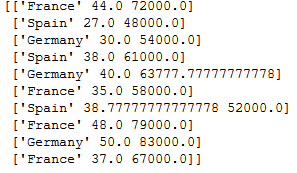
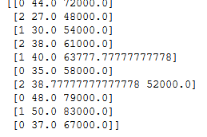
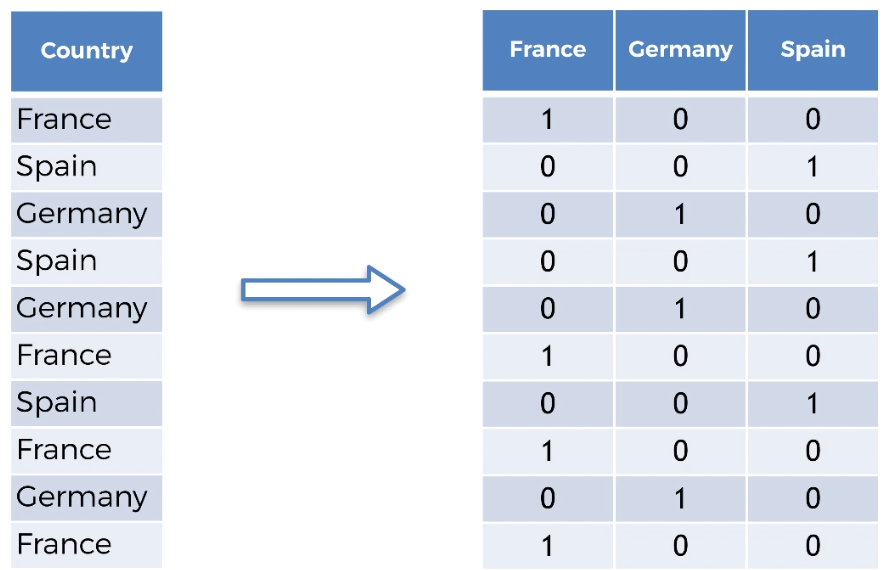
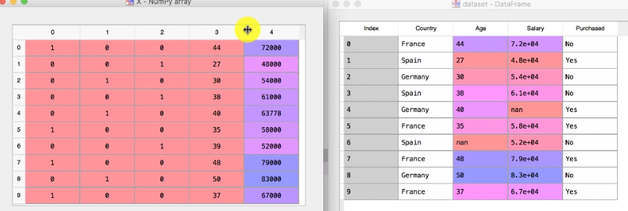
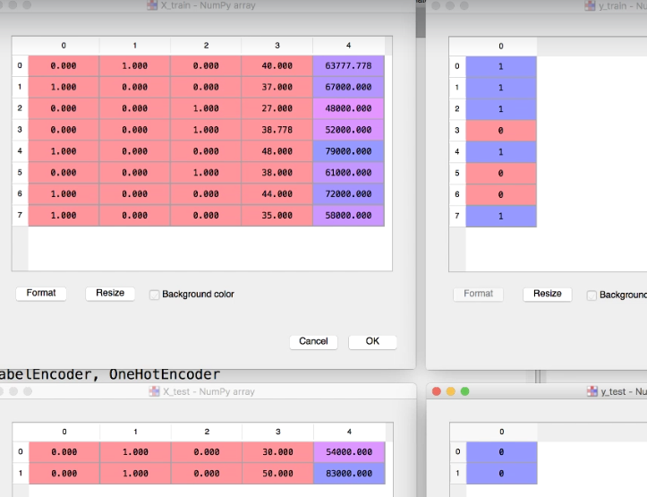
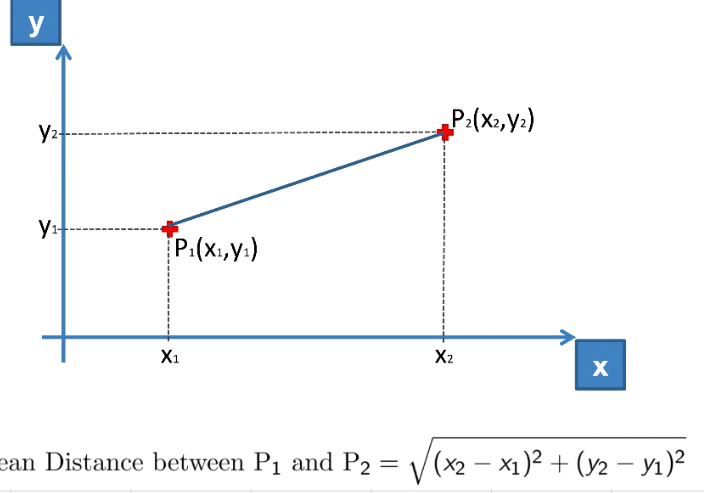
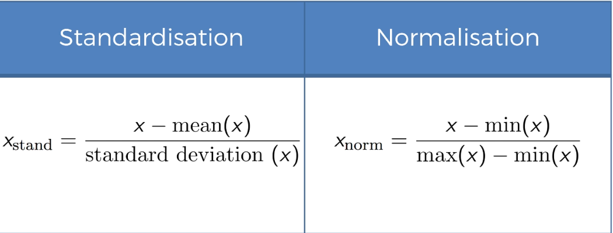
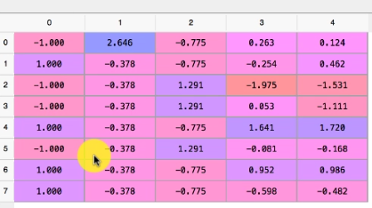

# Data Preprocessing

### Get the Dataset
 - Download the following zip files
    1. [Template](http://www.superdatascience.com/wp-content/uploads/2017/02/Machine_Learning_AZ_Template_Folder.zip)
    2. [Files and Data](http://www.superdatascience.com/wp-content/uploads/2017/02/Data_Preprocessing.zip)

- Unzip the folder and copy `Files and Data` under folder location `Machine Learning A-Z Template Folder\Part 1 - Data Preprocessing`
### Review the dataset


The above dataset shows Country, Age, Salary and Purchased. The field that we need to research is called `Dependent field` and others are called `Independent Field`
#### Dependent Field
A dependent field is a whose outcome or value is derived from other fielda. In this example, we are trying to find Whether a customer made a purchase or not. Hence, `Purchased` here becomes the dependent field. In terms of coordinate, if we map this on the graph then `Purchased` will be plotted on the y-axis.

#### Independent field
Independent fields are values that we observe. Example - If I stand on the side of the freeway and start noting down the color of each car passed, whether it is a car or a truck, is it raining that day or sunny? etc. These values are called Independent fields. In the above datasheet, `Country`, `Age` and `Salary` are independent fields.

In data science, everything is a function. Hence if `Purchased` field = `Y` and `Country`, `Age` and `Salary` can be represented as `c`, `a` & `i` respectively. Then the above function can be represented as

 `Y = Xc + Ta + Zi`

 ### Importing the essential library
 There are three essential libraries for most basic machine learning projects. Add the below library

 `
 import numpy as np
 import matplotlib.pyplot as plt
 import pandas as pd
 `


```python
# Importing the libraries
import numpy as np
import matplotlib.pyplot as plt
import pandas as pd
```

### Import the dataset
Use panadas to import the file data.csv file


```python
#Import the dataset
dataset = pd.read_csv("../data.csv")
```


```python
dataset.head(6)
```


<div>
<style scoped>
    .dataframe tbody tr th:only-of-type {
        vertical-align: middle;
    }

    .dataframe tbody tr th {
        vertical-align: top;
    }

    .dataframe thead th {
        text-align: right;
    }
</style>
<table border="1" class="dataframe">
  <thead>
    <tr style="text-align: right;">
      <th></th>
      <th>Country</th>
      <th>Age</th>
      <th>Salary</th>
      <th>Purchased</th>
    </tr>
  </thead>
  <tbody>
    <tr>
      <th>0</th>
      <td>France</td>
      <td>44.0</td>
      <td>72000.0</td>
      <td>No</td>
    </tr>
    <tr>
      <th>1</th>
      <td>Spain</td>
      <td>27.0</td>
      <td>48000.0</td>
      <td>Yes</td>
    </tr>
    <tr>
      <th>2</th>
      <td>Germany</td>
      <td>30.0</td>
      <td>54000.0</td>
      <td>No</td>
    </tr>
    <tr>
      <th>3</th>
      <td>Spain</td>
      <td>38.0</td>
      <td>61000.0</td>
      <td>No</td>
    </tr>
    <tr>
      <th>4</th>
      <td>Germany</td>
      <td>40.0</td>
      <td>NaN</td>
      <td>Yes</td>
    </tr>
    <tr>
      <th>5</th>
      <td>France</td>
      <td>35.0</td>
      <td>58000.0</td>
      <td>Yes</td>
    </tr>
  </tbody>
</table>
</div>


### Create the dependent and Independent Variable matrix of features


```python
x = dataset.iloc[:, :3].values
y = dataset.iloc[:, 3:4].values

```

### Identify the missing data
In the real world when you are handed a dataset. You will find that a lot of data might be missing. Ex - `Row 6 Salary` is empty and `Row 7 Age` is missing in our data.csv


### Strategies to handle missing data
- Remove the rows that have missing data. This approach is simplest but will skew our dataset if lots of fields are missing.
- Replace the missing data with Mean
- Replace the missing data with Median
- Replace the missing data with Mode or Frequency

As a general rule of thumb `mean` and `median` can be applied to numerical values only. It cannot be applied to alphanumeric or String values. This is where we can use Mode or Frequency.


### Taking Care of missing data * (Numerical values)*
`Scikit` library in python provides a class called `Imputer` which helps in fixing the missing values using the above strategies.


```python
from sklearn.impute import SimpleImputer
imputer = SimpleImputer(missing_values = np.nan, strategy='mean')
imputer = imputer.fit(x[:,1:3])
x[:, 1:3] = imputer.transform(x[:, 1:3])
```

In the above code we define a `SimpleImputer` class object.
`imputer = SimpleImputer(missing_values = np.nan, strategy='mean')`

The next line `imputer = imputer.fit(x[:,1:3])` is telling imputer object on which matrix columns it needs to look for missing value and mark them for filling value as mean

The last   line `x[:, 1:3] = imputer.transform(x[:, 1:3])` fills in the cells of X matrix that were marked by the imputer.

*One thing that I wanted to try was that would happen if I just used `imputer.fit(x)` and did not provide the columns which actually had the missing values. What happens is that since you have marked the strategy as `strategy='mean'`, the imputer will try to take the average/mean of each row `country`, `Age` & `Salary`. Since `Country` is of type String, python will shit in its pant and complain about it. However, if the `Country` column was numeric, then this `imputer.fit(x)` would have worked. Additionally, on the left side we have defined that data be copied into x[:, 1:3]. This is because if you write `x = imputer.transform(x[:, 1:3])`, imputer has marked the cell to be transformed is `(1,5)` as there are two columns it is looking at `Age` and `Salary`  but if put only x on the left side, then `(1,5)` refers to `Age` 40, while imputer is expecting it to be a `Salary` column.*



As you can see, the imputer has filled in the missing values for `Salary` as $63777.78  and `Age` as 38.7.


### Taking care of Categorical data
Categorical data is any data that is not numeric. Think of it as attributes of an object. Ex - If I am observing cars on a freeway and noting down the speed at which the car is driving and the color of the car. The cars may have different colors such as red, green, blue etc. I can only observe them but cannot do anything else with them like add, subtract, find mean or anything. However, a machine learning algorithm may see value in finding a relation between dependent and independent feature. The algorithm can only make use of item if it is defined in numbers.

One way to define them is by assigning them numbers ex- Red =1, Blue =2 and so on.
In our current example, we have a categorical data - `Country`. To convert or encode as it is called in ML, we will again use a library from `Scikit`


```python
from sklearn.preprocessing import LabelEncoder
labelEncoder_x = LabelEncoder()
x[: ,0] =labelEncoder_x.fit_transform(x[:, 0])
x
```


    array([[0, 44.0, 72000.0],
           [2, 27.0, 48000.0],
           [1, 30.0, 54000.0],
           [2, 38.0, 61000.0],
           [1, 40.0, 63777.77777777778],
           [0, 35.0, 58000.0],
           [2, 38.77777777777778, 52000.0],
           [0, 48.0, 79000.0],
           [1, 50.0, 83000.0],
           [0, 37.0, 67000.0]], dtype=object)


The above code uses `LabelEncoder`  class to encode the values of the country. Here, France =0, Spain = 2, Germany=1
There is however a simple problem here.

#####Problem:
The models are based on equation. Since the LabelEncoder here, has assigned them values 0,1,2, the equation would think that Germany has higher value than France and Spain has a higher value than Germany. This certainly is not the case. These are supposed to be treated as observational values. Example - Picking on our earlier example of observing car speeds and color. If we use LabelEncoder for encoding car colors, the model may come back and say that A `red Prius` will always be faster than a `White Ferrari`

To get over this problem and use category as markers, we will use another class which will create dummy encoding and this gives equal value to all categorical data. It does that by creating a sparse matrix.



```python

from sklearn.preprocessing import OneHotEncoder
oneHotEncoder = OneHotEncoder(categorical_features=[0])
x= oneHotEncoder.fit_transform(x).toarray()

```


So after dummy encoding, the complete sparse matrix of `x` looks like this


So now let's convert the dependent column `Purchased` as well. However, we do not need to use dummy encoding as there are only two variables and that it is a dependent variable.


```python
labelEncoder_y = LabelEncoder()
y =labelEncoder_y.fit_transform(y)
```

### Splitting dataset into training and test set
- **Why do we need to split the data into training and test set?**
  1. This is about an algorithm that will create the equation to predict the result of new information based on history. If you let it run on all of the data then it will learn too much and will have correlation value or in other words overfitting.  A simple example in the real world is of a boy who memorizes the book word by word but fails in the actual exam because instead of asking what is 2 +2 like he read in the book, the exam asked what is 1+3. The student learnt too much but cannot relate or imply the same knowledge on a new data set.

  2. Sometimes you may have limited data to build the model and may not additional data to test your model.

- ** What is a good ratio to split the data?**
    Usually, 80/20 or up to 70/30 is a good number. Going beyond 70/30 is not recommended.

To split a dataset into training and test set. We will use another class called `train_test_split`, which returns 4 different values - Training_X, Test_X,Training_Y, Test_Y


```python
from sklearn.model_selection import train_test_split
x_train, x_test, y_train, y_test = train_test_split(x,y, test_size=0.2, random_state=0)
```

The data is now split into 8 and 2 observation.



### Feature Scaling/ Normalization/Standardization
If you look your dataset and pay attention to independent features `Age` and `Salary`, the range varies for `Age` between `27 - 50` and `Salary` between `48000 - 83000`. When an equation is created, the distance between two dat apoints is huge and the values can be skewed because one of the columns have 27 for age and 83000 for salary.


The models are usually based on Euclidean distance. In our case since Salary has a higher range, it will dominate the age values which means when we do distance between observation  (27, 48000) and (48, 79000) then (x2-x1) ^2  vs (y2-y1) ^2 is
441 vs 961000000. Hence Age is overshadowed by Salary.



If you are from statistics field, you probably are already familair with standardization or Z-index etc. Above is the two way to calculate the standard range which will always give us a value between  **0 and 1**


```python
from sklearn.preprocessing import StandardScaler
sc_x = StandardScaler()
x_train = sc_x.fit_transform(x_train)
x_test = sc_x.transform(x_test)
```

**NOTE**: We are not fitting and transforming the `x_test` because it is already fitted based on `xtrain` so that they are now on the same scale. If we would have used fit_transform on both test and train then their scale would have been different say one could between -1 and +1 while the other could be on -3 and +3



- **Why did we not apply feature scaling on `y` or dependent variable?**
  In this case, the values are 0 and 1 only or in other words, this is a classification problem which has two choices, whether a customer bought the product or he did not buy the product. In other scenarios such as that related to multiple regression, we may have situation where we may have to do feature scaling on `y` as well.
