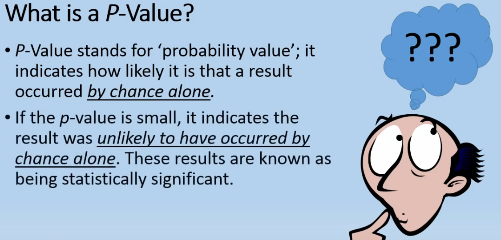
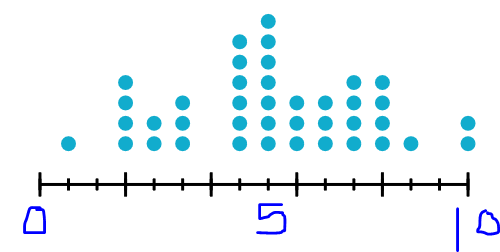

# Part 3 Machine Learning: Undersatnding P-Value

In the [previous post](http://javahabit.com/2019/01/22/part-2-ml-simplelinear-regression/), we learnt about Simple Linear regression. I wanted to start this section with multiple linear regression tutorial but as I was going over the content on the template to run create the regression model, I felt that we need understand P-Value concept before we move ahead. 

So what is **P-Value** ?


 Before I bore you with stats definition of the P-Value. Let's start with something simple.
 Mr X and Mr Y are good friends. One day Mr X and Mr Y decided to go scuba diving. The water in the lake was perfect blue and you could see the bottom and all the fishes swimming in there. After a while,
 
 `Mr X:` 
 > *I deem that more than 10% of the fishes in the lake are male".*

`Mr Y`  who was also the warden of the lake.
 >*It is not possible as they release more female fishes than male.* 

`Mr X:` 
 >*Every other fish that I see is male, hence my statement stands correct.*

`Mr Y:` 
 > *Let's use stats and find out if your statement is true. As I am the warden and know the fact that there are more female than male. Let's call my statement as*
 
 >*H<sub>0</sub>: "There are more female than male."
 and your statement as *
 
 >*H<sub>a</sub>: "The number of male fish in the lake is more than 10%*
 
 `Mr Y:`
 > *Now if only I can prove that chances of my statement **H<sub>0</sub>** happening is much higher than then your statement **H<sub>a</sub>** can be rejected. Let's use P-value*
 
 `Mr X:`
 > *What's a P-Value?*
 
 `Mr Y:`
 > *So based on the definition below, if we catch 10 samples of fish from the lake and 2 or more of those are male. We will then repeat the experiment multiple times and note down the result. Then we will find out the probability of the number of males caught in 100 experiments and conclude that my statement **H<sub>0</sub>** is true and you cannot reject my argument.* 
 
 
 




`Mr X`
>I caught 10 fishes and got 7 are female and 3 are male. I will now repeat this experement 100 times.

Based on the above experiment what is the likelihood that `Mr X` would have got the same result? Calculating this likelihood is called **`P-Value`**.

>What do we do with this P-Value?

The `P-Value` is used to validate a hypothesis. In the above example, the significance level chosen was 0.05. The P-Value calculated(Standard way using historgram)


So based on the above histogram shows how many females were caught. The diagram above is a random diagram that I copied from a different dataset. But assume that number of times the male figure was more than 1 is 21. Then the 
>*probability(fish is male) = 21/100 or 0.21 or 21%*

So Hypothesis rule is that if the 
> p-value is **less than** Significance level - Reject the `H<sub>0</sub>`
p-value is **greater than or equal to** Significance level - Cannot reject the `H<sub>0</sub>`. We do not have enough eveidence for the claim `H<sub>a</sub>`

In the above case we chose `Significance level = 0.01` and our `p-value=0.21`, so which means that we cannot reject the null hypothesis or `H<sub>0</sub>` and we do not have enough evidence to say that `Number of male fishes is more than 10% in the lake`

This conclues this series on P-Value. In the [next series](http://javahabit.com) we will review Multiple linear regression and you will understand how P-Value fits in the bigger picture. 


```python

```
