# Multiple Linear Regression


In the [previous post](http://javahabit.com/2019/01/27/part-3-ml-understanding-p-value/), we learnt about a P-Value, a prerequisite for learning Multiple Linear Regression.

**Business Problem**: In this series, we will take a look at a dataset of 50 startup companies.
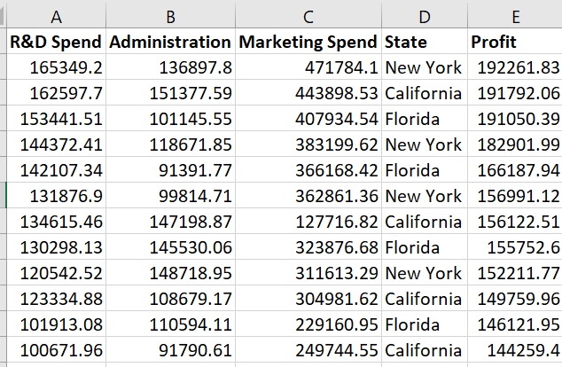
A venture capitalist has hired you as a data scientist and wants you to help him select which type of company he should invest so that he can make the most profit. You need to review spending on R&D,  Admin cost, marketing cost and location to make the decision


## How to get the dataset?
- [Startup Dataset](https://github.com/dinesh19aug/ml-notes/blob/master/Part-4-multiple-regression/50_Startups.csv)
- [Multiple Regression notebook](https://github.com/dinesh19aug/ml-notes/blob/master/Part-4-multiple-regression/multiple-regression.ipynb)

## What is Multiple Linear Regression?
In the [second post](http://javahabit.com/2019/01/22/part-2-ml-simplelinear-regression/) on linear regression, our equation was simple and straight-forward

> Y = mX + C

where `Y` was the dependent variable, `X` was the dependent variable and `c` was the Y-intercept when `X = 0`. The reason the equation was simple because the `Y` was dependent on one variable only. If there were multiple variables affecting the value of `Y`, then what should it be called? - :-). You know the answer to that question.
> Multiple Linear Regression!!!

The equation would also be something as simple as that
>Y = b<sub>0</sub>X<sub>0</sub> + b<sub>1</sub>X<sub>1</sub>+b<sub>2</sub>X<sub>2</sub>+ .... + C

## Steps to solve the problem?

- **Step 1: Data pre-processing and analysis**

Take a closer look at dataset. You will notice that all the `Independent Variables`, except `State`, is numerical. The variable `State` is either **California** or **New York**. From our [first post](https://github.com/dinesh19aug/javahabit.com/blob/master/content/posts/Part-1-Machine-learning-data-preprocessing.md), you would know that this type of data is called categorical data. We should always convert categorical data into numerical data to avoid bias and find if there is collinearity between `Profit` and `State`. **Collinearity** is just a fancy way of asking - *"Is there some relation between `Profit` and `State`?*.
When you convert a categorical data to numeric data, the new column is called **Dummy Variable**. So as we learned from our [first post](https://github.com/dinesh19aug/javahabit.com/blob/master/content/posts/Part-1-Machine-learning-data-preprocessing.md), we should convert it to a sparse matrix.
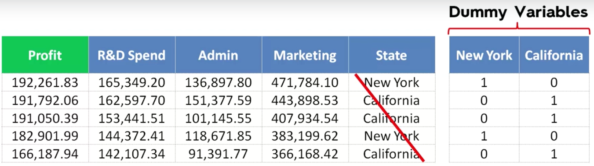

**Question**
> *Do you need two columns to represent **New York** and **California** states?
The answer is **No**.

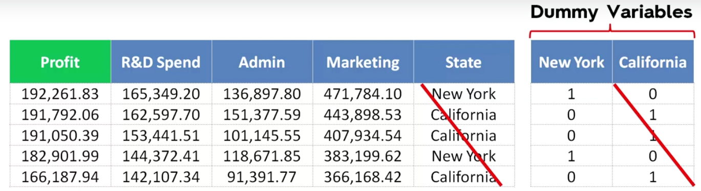

It is easy to derive from the above screenshot that if **New York** is 1 then **California** by default would be 0 and vice-versa. So this actually works like a switch which can have only 2 states **0** or **1**.
> Important tip: You should never use all of your dummy variables in your Regression column. They should always be **1** less than the number of values.

**If we drop one dummy variable then are we not making this a biased equation**

Without dropping column my equation would look like this
> Y = b<sub>0</sub>X<sub>0</sub> + b<sub>1</sub>X<sub>1</sub>+ b<sub>2</sub>X<sub>2</sub> + b<sub>3</sub>X<sub>3</sub> + b<sub>4</sub>X<sub>4</sub> + b<sub>5</sub>X<sub>5</sub> + C

After Dropping one dummy variable
> > Y = b<sub>0</sub>X<sub>0</sub> + b<sub>1</sub>X<sub>1</sub>+ b<sub>2</sub>X<sub>2</sub> + b<sub>3</sub>X<sub>3</sub> + b<sub>4</sub>X<sub>4</sub> + C

If we dropped the variable then it may appear that when `California` is the state then the value of **b<sub>4</sub>X<sub>4</sub>** will be 0, hence we lose one variable. In reality, the regression algorithm marks that the first dummy variable which is represented by `0` is set as default. So, the regression equation will never be biased. The regression equation is going to use constant `C` to adjust the value of `California`.

**But what is wrong with using all the dummy variable?**

When you use both the values, your equation would be something
> Y = b<sub>0</sub>X<sub>0</sub> + b<sub>1</sub>X<sub>1</sub>+ b<sub>2</sub>X<sub>2</sub> + b<sub>3</sub>X<sub>3</sub> + b<sub>4</sub>X<sub>4</sub> + b<sub>5</sub>X<sub>5</sub> + C

If we do this then we will introduce multi-collinearity, where the algorithm will not be able to able to distinguish the effect on `Price`. This is because **D<sub>2</sub>** is always equal to **1 - D<sub>1</sub>**. The algorithm will then try to predict the effect of `D2` over `D1` and would think that there is a relation between `Independent` variable as well.

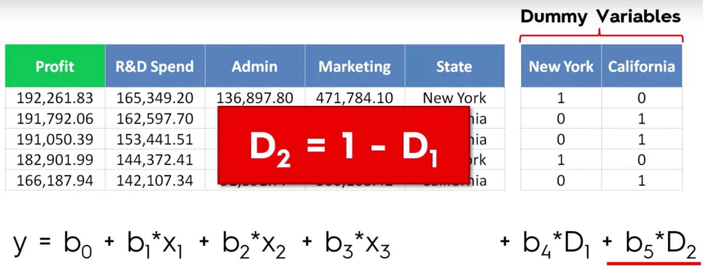


- **Step 2: Understanding all possible methods to build a model using Multiple Linear Regression models**

There are 5 methods to build a model
    - All in one
    - Backward Elimination
    - Forward Selection
    - Bi-Directional Elimination
    - Score comparison

 > **All In**: All in means that you use all the variables when you know for sure that all the independent variables have a definite effect on the dependent variable. An example is that if doctors told you for sure that to live past 80 yrs of age, you should eat good food and exercise daily. In other words, you have domain expert telling you that all the variables directly affect the dependent variable.

 > **Backward elimination**: In backward elimination, you take all the variables and create the algorithm. Select a significance level, then consider the predictor with *Highest P-value* and if `P-Value > Significance level` then eliminate the variable from the equation, else keep it.
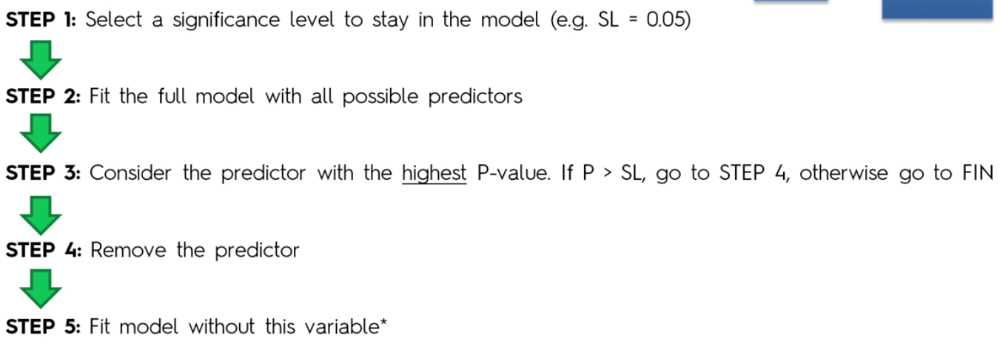

 > **Forward Selection**: In forward selection, you start with linear regression using every single variable. You will end up with `n` simple linear equation. Next, you chose the one with the lowest P-Value. This is your starting equation. **Y = m<sub>0</sub>X<sub>0</sub>**. Next, you pick one variable again and create an equation with two variables and out of `n-1` possibilities again chose the one with the lowest P-value. The process continues until we don't have any variable that is lower than our selected Significance level.
 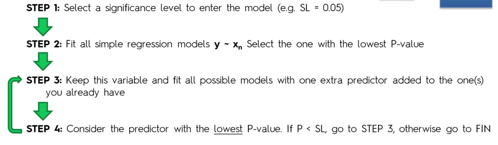

  > **Bi-Directional elimination**: In bi-directional elimination, you chose 2 significance level. One to enter the equation and one to stay. You start with the forward selection using condition **P-Value < SL <sub>Enter</sub>** and then follow backward elimination using condition **P-value < SL<sub>stay</sub>**. You stop and declare the final equation when no new variable can enter or exit the equation.
 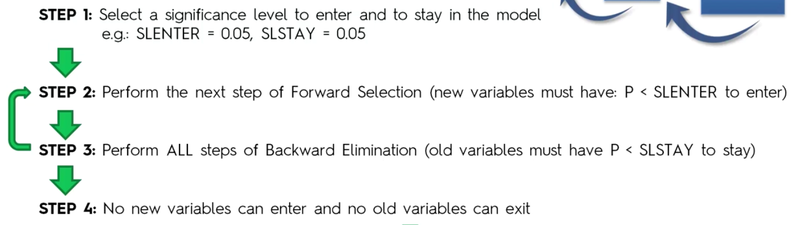

 > **Score Comparison**: In this model, you create all possible combination of the equation, compare the performance using say MSE(Mean Square Error) and use the one with the lowest MSE. That is an insane amount of possible equation. For Example - A model with 10 variables will have 1023 possible combination.
 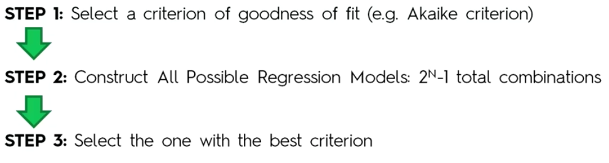

 **Note for the purpose of brevity and sanity, we will be using `Backward Elimination ` model to solve this problem. Also, because this model is fastest and we will still be able to see how the step by method works.**

- **Step 3: Data preprocessing in python**

We will now start the calculation using the process that we learnt in the [first post of this series](http://javahabit.com/2019/01/21/part-1-ml-data-preprocessing/). If you remember from Linear regression post


```python
# -*- coding: utf-8 -*-
import numpy as np
import matplotlib.pyplot as py
import pandas as pd

#Read the dataset
dataset = pd.read_csv("50_Startups.csv")

#Divide the dataset in dependent and Independent variables
X= dataset.iloc[:, :-1].values
y = dataset.iloc[:, -1].values


```

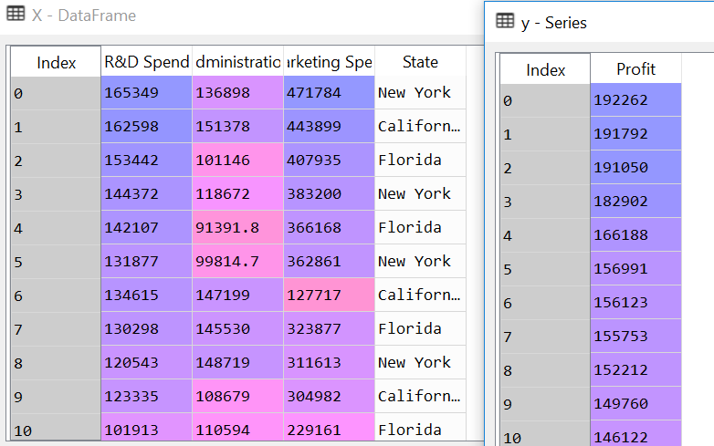


```python


```

Next part of data processing is to find if there is any missing data. If there is missing data then we need to use **Imputer** to fix the missing data. To do that we will first check the data description, then try to get a count of missing values in the dataset


```python
#Describe the dataset
pd.DataFrame.describe(dataset)
#Check for missing data
null_columns=dataset.columns[dataset.isnull().any()]
num_emptycolumns = dataset[null_columns].isnull().sum()
print(num_emptycolumns)

```

    Series([], dtype: float64)


Currently, there are no missing values in the dataset hence the result of **`num_emptycolumns`**.

Moving on to the next item in the data clean up is taking care of categorical values in the **`State`** column.


```python
#Taking care of Categorical values.
from sklearn.preprocessing import OneHotEncoder, LabelEncoder
label_encoder = LabelEncoder();
X[:,3]=label_encoder.fit_transform(X[:, 3])
oneHotEncoder = OneHotEncoder(categorical_features=[3])
X= oneHotEncoder.fit_transform(X).toarray()
```


```python

```

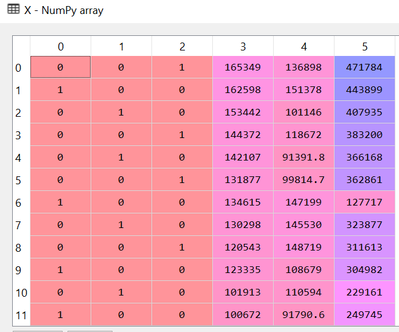

> **Hey, what about all the talk about keeping n-1 categorical items?**

So you are right to notice that whatever we did will lead us directly to the dummy variable trap. I fell into one when I was trying to learn it. So how do we fix it? If you have been thinking about just crossing out one of the columns as we did in the pic few scrolls above ....... you are right!!! That's exactly how we are going to fix it.


```python
#getting out of dummy variable trap
X = X[:,1:] # Select all the rows and all the columns starting from index 1 onwards.
```

Now divide the data in training and test set


```python
#Create training and test set
from  sklearn.model_selection import train_test_split
X_train, X_test, y_train, y_test = train_test_split(X, y,
                                                    test_size = 0.20,
                                                    train_size=0.80,
                                                    random_state=0)
```

**Step 4: Training the model**

Now that we have cleaned up our data, we can train our data. We are not going to do any feature scaling here, because the library and class that we are going to use, will do that automatically for us. We will use the same **`LineaRegression`** class that we used in the [linear regression post](http://javahabit.com/2019/01/22/part-2-ml-simplelinear-regression/).


```python
from sklearn.linear_model import LinearRegression
regressor = LinearRegression()
regressor.fit(X_train, y_train)
```


The above code trained our data. Now we need to check how does our model score or how good is it at predicting the data?
To Predict we just need to call the predict function.


```python
y_pred = regressor.predict(X_test)
```

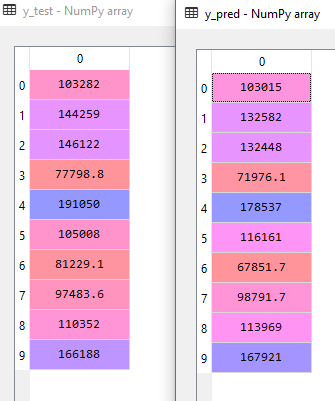

You can see that the predicted values **`y-pred`** is pretty close to **`y_test`**. Some of the rows do have a significant difference and the numbers may look far apart but the others are pretty close. So how close are we? How confident are we that the trendline would fit closely. To answer this we need to look at our training and test score.


```python
print('Train Score: ', regressor.score(X_train, y_train))
print('Test Score: ', regressor.score(X_test, y_test))

```

    Train Score:  0.9501847627493607
    Test Score:  0.9347068473282446


The above score tells us that our model has **`95%`** and `93.5%` accurate for training and test data. This not bad.
One last thing that I learnt was that if someone asked me how do I calculate the future values that may come up? To do that we need to get the co-efficient and intercept of the regression equation. The regression equation as discussed earlier would look something like this -
> Y = b<sub>0</sub>X<sub>0</sub> + b<sub>1</sub>X<sub>1</sub>+ b<sub>2</sub>X<sub>2</sub> + b<sub>3</sub>X<sub>3</sub> + b<sub>4</sub>X<sub>4</sub> + b<sub>5</sub>X<sub>5</sub> + C


```python
print(regressor.coef_)
print(regressor.intercept_)

```

    [-9.59284160e+02  6.99369053e+02  7.73467193e-01  3.28845975e-02
      3.66100259e-02]
    42554.16761772438


If we take the first row from `X_test` - 1	0	66051.5	182646	118148
> 1*-9.59284160e+02 + 0*6.99369053e+02 + 66051.5 * 7.73467193e-01 + 182646*3.28845975e-02 + 118148 * 3.66100259e-02 + 42554.16761772438

The output would be **`103015.19329118208`**, which is same as first row of **`y_pred`**.  


```python
1 * -9.59284160e+02 + 0 * 6.99369053e+02 + 66051.5 * 7.73467193e-01 + 182646 * 3.28845975e-02 + 118148 * 3.66100259e-02 + 42554.16761772438
```


    103015.19329118208


So that is the most basic way to do to solve a problem using Multiple Linear regression. Hope you enjoyed this series. Stay tuned for the next series where we will actually see the continuation of **`Multiple Linear regression`** and learn the **Backward Elimination process**.
