# Decision Tree Regression

In the [previous post](http://www.javahabit.com/2019/02/10/part-6-ml-svr/), we learnt about Support vector regression. In this post, we will see a new way of deciphering information using a simple format of traversing conditions.

**Business Goal**: Can you spot the king? The people of *Falkland* are scared. Their king disguises as a common man and roams among them to gain knowledge about his kingdom and see if his policies are working in his kingdom. When the king is disguised, the common people don't recognize him. If they accidentally mistreat the king when he is disguised, they get punished. Can you help the people of *Falkland* spot the king?

### How to get dataset?
- Decision Tree dataset
- Decision tree notebook

### What is a "Decision Tree"'"?
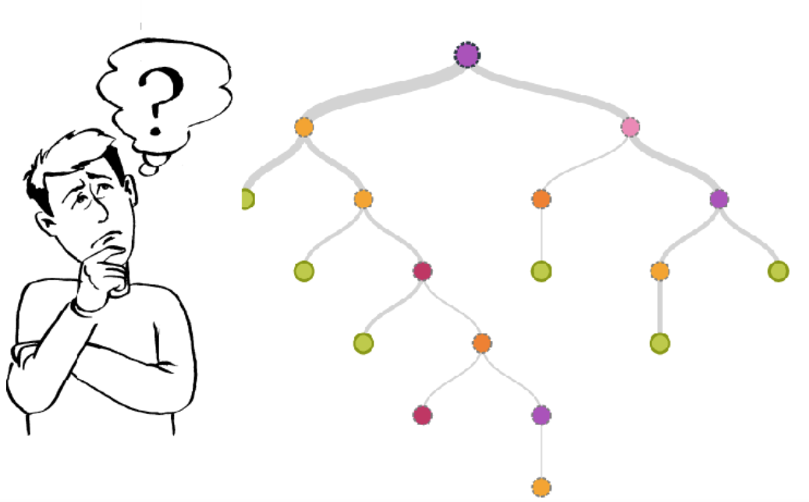

>A Decision tree is a set of 'yes' or 'no' flow, which cascades downward like an upside down tree. For example, given a set of independent variables or features about a person, can we find if the person is healthy.  

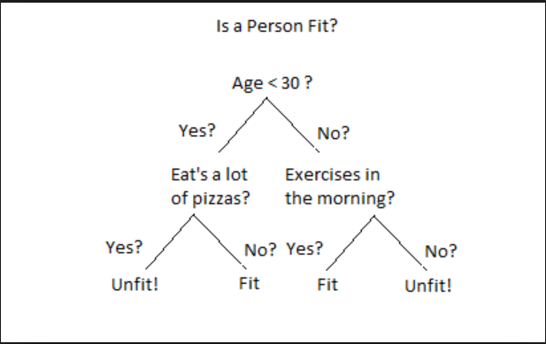


### Parts of decision Tree
- Each decision point is called a **Node**. Ex - __Age < 30__
- Each connector is called an __Edge__.
- Each node which does not have any subnode is called a __Leaf__. Ex - __Fit__ or __Unfit!__.

### How is the tree built?
To build a tree, we need to start with an *Independent Feature* as a root node. The possible attributes or unique values of that feature form the edges. Once the first level of the tree is completed, attach another feature node at the end of each node and traverse deeper. Once you have exhausted all the features, you will arrive at the dependent value or result.

### Can we just start with any random feature as the root node?
This is a million $$$ question here. This is the meat of the whole algorithm. Let's look at our business problem about the problem that people of *Falkland* are facing. We need to come up with a solution to spot the king when he is disguised to save the common man from mistreating him accidentally and hence punished in return. Here's the data that we have collected about people leaving the castle.
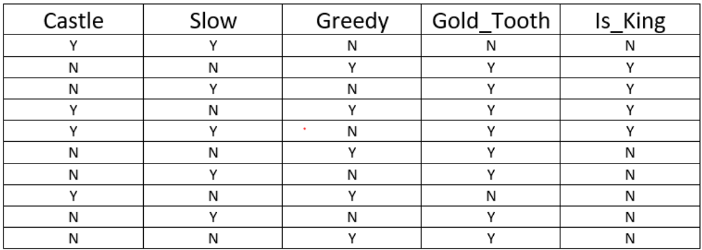

> Ok! So we have the data, but how do we find out which feature will be the root node?   

Going back to our previous [post](http://www.javahabit.com/2019/02/10/part-5-ml-mltr-backward-elimination/) on [__Backward Elimination__](http://www.javahabit.com/2019/02/10/part-5-ml-mltr-backward-elimination/), we can gather that the root node should be a feature which is the most important feature in making the decision. To find the most important feature, we will align each independent feature with dependent feature (*Is_King*).

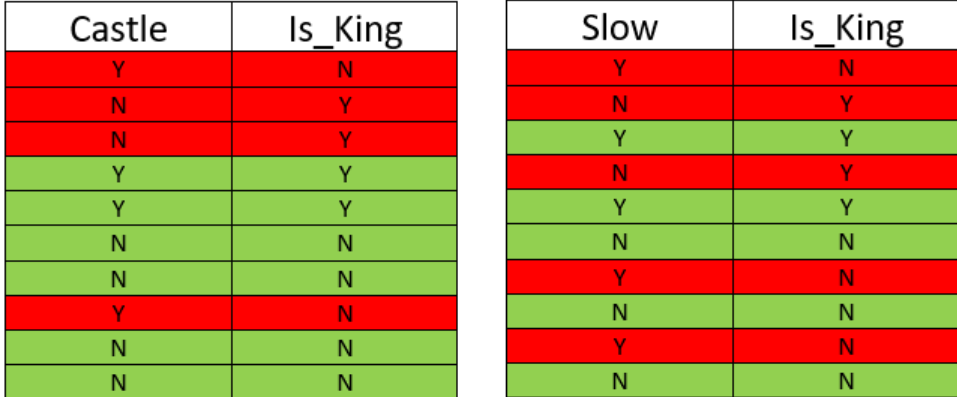
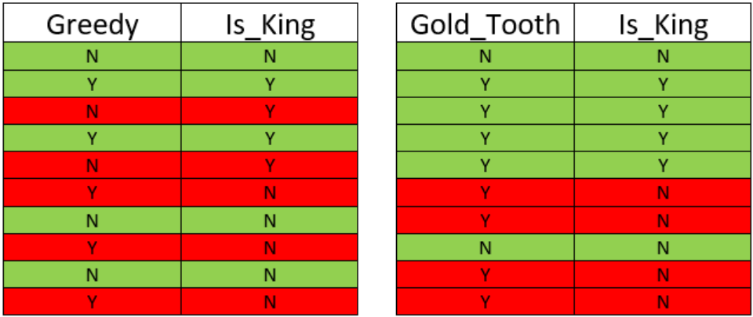


If we look at the above mapping, we will see that **Gold_Tooth** feature is right most of the time in predicting the king, followed by the **castle** as it has the least number of false positive.

> Well, that's good to know, but I noticed that you did talk about the last two features - __Greedy__ and __Slow__.  

Yes, the distinction between the two is difficult to figure out. Both __Greedy__ and __Slow__ features have an equal number of false positives. To understand, which feature is more important than the other, we need to understand __Data Entropy___.

### What is Data Entropy?
Entropy means how many times information changed that we got a positive result. Imagine if the king never left the castle, which means that all the information that we collected will show __Is_King__ as **0**. In our case, the entropy is **1** because anybody could be the king. If we just had **Castle** as the feature, predicting the king would be difficult without another piece of information.
>So in simple terms __Entropy__ is how many pieces of the data point(*Independent feature*) is required, to guess the *Dependent variable* - *Is_King*__

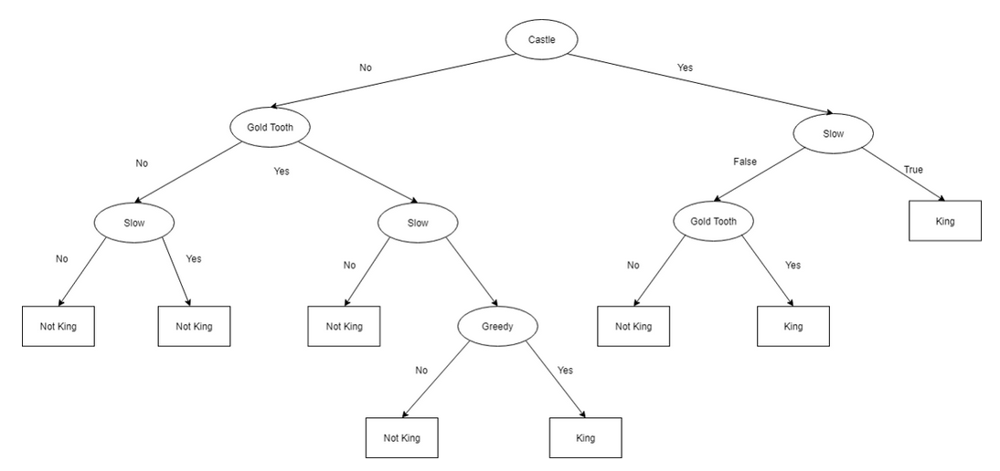

To further explain. Let's say that instead of starting with **Gold_tooth** as the root node, we start with the **castle**. We will see that we are able to find the king only __3/10__ times. On top of that, the left side gives very poor results. Just __1/5__ or __20%__.

There is another problem with the above tree. It is too overcomplicated and is **overfitted**. If we get  new data the accuracy of our model could fall drastically.

Going back to our learning in the [earlier post](http://www.javahabit.com/2019/02/10/part-5-ml-mltr-backward-elimination/), the simpler model should be preferred over the complicated model to avoid overfitting.

### How to avoid overfitting in decision Tree?  
Just remember the 3 golden rules to avoid overfitting:

1. Use a smaller number of data points to build the tree. Ex - 10% of data points is a good place to build a generic model.

2. Do not go overboard with the depth of the tree. A tree depth should only be increased if there is a significant improvement in the prediction.

3. Stop, if the number of data  points at the split is less than 5%.

Here's a refined version of the tree.

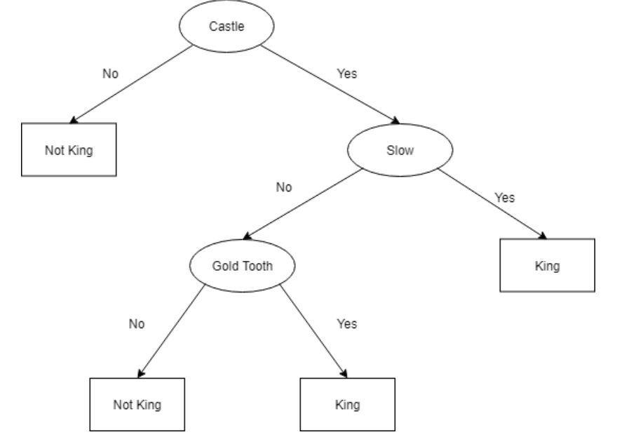

### Would this model work on non-categorical or continuous values?
Absolultely!! The splitting rules would still apply as I mentioned above.

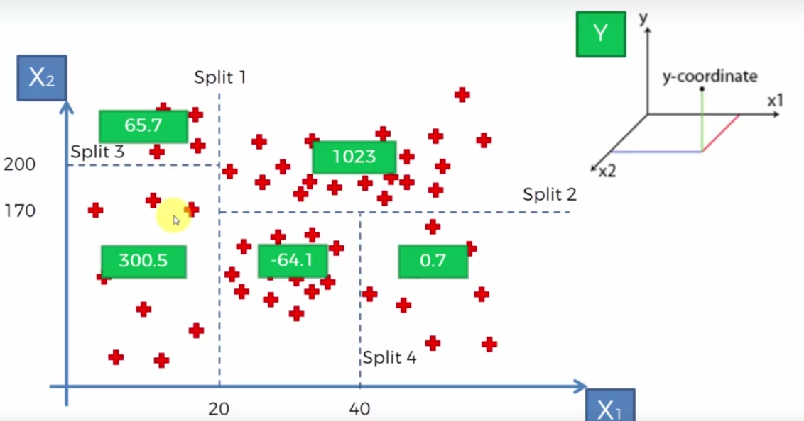

So each Split is a leaf node above. Imagine if we wanted to find the dependent variable __Y__ whose independent partners __X1__ and __X2__ are __10__ and __150__, then it would land in the first node as __300.5__.

> I get why it landed in first leaf node position but where did we get value **300.5**?  
The value 300.5 is the average of all the data points in that box.  

> **Pay attention and read the previous 2 lines again.** The last two lines will help you understand why we need to divide it into different leaves and nodes. If you do not have splits, then the only option is to take the average of the **ALL** the data points!! The accuracy would be nowhere close to your expectation and would be same all values of X1 and X2.


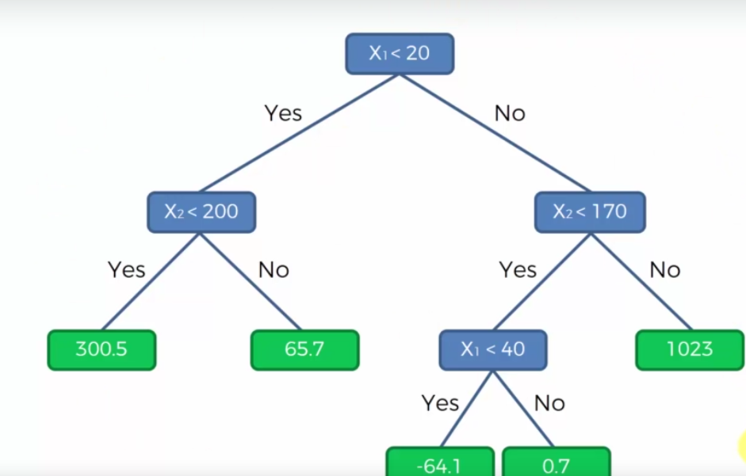

### Python Implementation
We are going to take a standard dataset called IRIS Dataset
>“The Iris flower dataset or Fisher’s Iris dataset is a multivariate dataset introduced by the British statistician and biologist Ronald Fisher in his 1936 paper ‘The use of multiple measurements in taxonomic problems as an example of linear discriminant analysis’.” — Wikipedia

In layman terms, it is a set of data points about IRIS flower where we have the information about the length and the width of sepals and petals about 3 varieties.

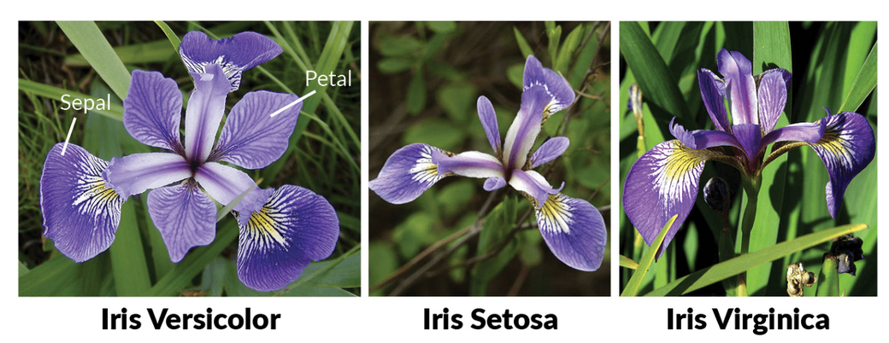

__Step 1:__ Get the common imports


```python
# Importing the libraries
import numpy as np
import matplotlib.pyplot as plt
import pandas as pd
from sklearn.tree import DecisionTreeClassifier
dataset = pd.read_csv("iris.csv")
```

__Step 2:__ Identify the missing data


```python
dataset.isnull().any()
```


    sepal-length    False
    sepal-width     False
    petal-length    False
    petal-width     False
    species         False
    dtype: bool


**Step 3:** Describe the data and identify the data types


```python
dataset.describe()

```


<div>
<style scoped>
    .dataframe tbody tr th:only-of-type {
        vertical-align: middle;
    }

    .dataframe tbody tr th {
        vertical-align: top;
    }

    .dataframe thead th {
        text-align: right;
    }
</style>
<table border="1" class="dataframe">
  <thead>
    <tr style="text-align: right;">
      <th></th>
      <th>sepal-length</th>
      <th>sepal-width</th>
      <th>petal-length</th>
      <th>petal-width</th>
    </tr>
  </thead>
  <tbody>
    <tr>
      <th>count</th>
      <td>150.000000</td>
      <td>150.000000</td>
      <td>150.000000</td>
      <td>150.000000</td>
    </tr>
    <tr>
      <th>mean</th>
      <td>5.843333</td>
      <td>3.054000</td>
      <td>3.758667</td>
      <td>1.198667</td>
    </tr>
    <tr>
      <th>std</th>
      <td>0.828066</td>
      <td>0.433594</td>
      <td>1.764420</td>
      <td>0.763161</td>
    </tr>
    <tr>
      <th>min</th>
      <td>4.300000</td>
      <td>2.000000</td>
      <td>1.000000</td>
      <td>0.100000</td>
    </tr>
    <tr>
      <th>25%</th>
      <td>5.100000</td>
      <td>2.800000</td>
      <td>1.600000</td>
      <td>0.300000</td>
    </tr>
    <tr>
      <th>50%</th>
      <td>5.800000</td>
      <td>3.000000</td>
      <td>4.350000</td>
      <td>1.300000</td>
    </tr>
    <tr>
      <th>75%</th>
      <td>6.400000</td>
      <td>3.300000</td>
      <td>5.100000</td>
      <td>1.800000</td>
    </tr>
    <tr>
      <th>max</th>
      <td>7.900000</td>
      <td>4.400000</td>
      <td>6.900000</td>
      <td>2.500000</td>
    </tr>
  </tbody>
</table>
</div>


```python
dataset.dtypes
```


    sepal-length    float64
    sepal-width     float64
    petal-length    float64
    petal-width     float64
    species          object
    dtype: object


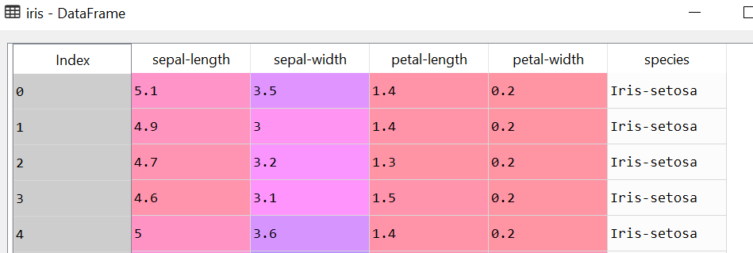

__Step 4:__ Load the Iris data and create the X and Y variables


```python

X= dataset.iloc[0:, 0:4].values
Y = dataset.iloc[:,4]
```

**Step 5:** Plot the data


```python


##Get the dataset for each of the three species
setosa=dataset[dataset['species']=='Iris-setosa']
versicolor =dataset[dataset['species']=='Iris-versicolor']
virginica =dataset[dataset['species']=='Iris-virginica']

#Create an empty figure with two windows pf size 21 by 10
plt.figure()
fig,ax=plt.subplots(1,2,figsize=(21, 10))

#Plot each species using Sepal length and width on x-y axis
setosa.plot(x="sepal-length", y="sepal-width", kind="scatter",ax=ax[0],label='setosa',color='r')
versicolor.plot(x="sepal-length",y="sepal-width",kind="scatter",ax=ax[0],label='versicolor',color='b')
virginica.plot(x="sepal-length", y="sepal-width", kind="scatter", ax=ax[0], label='virginica', color='g')

#Plot each species using Petal length and width on x-y axis
setosa.plot(x="petal-length", y="petal-width", kind="scatter",ax=ax[1],label='setosa',color='r')
versicolor.plot(x="petal-length",y="petal-width",kind="scatter",ax=ax[1],label='versicolor',color='b')
virginica.plot(x="petal-length", y="petal-width", kind="scatter", ax=ax[1], label='virginica', color='g')

#Give Each figure its names
ax[0].set(title='Sepal comparasion ', ylabel='sepal-width')
ax[1].set(title='Petal Comparasion',  ylabel='petal-width')
ax[0].legend()
ax[1].legend()

#Show the plot
plt.show()

```


    <Figure size 432x288 with 0 Axes>


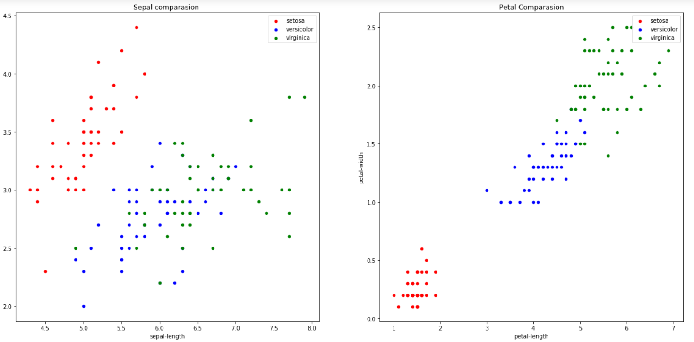

**Step 6:** Encode the value of Flower types
The values of dependent the variable needs to be encoded to numbers as they are categorical values


```python
from sklearn.preprocessing import LabelEncoder
labelEncoder_y = LabelEncoder()
Y = labelEncoder_y.fit_transform(Y)

```

**Step 7:** Split the data in training and test set


```python
from sklearn.model_selection import train_test_split
x_train, x_test, y_train, y_test = train_test_split(X,Y, test_size=0.2, random_state=0)
```

**Step 8:** Train the Decision Tree model


```python
from sklearn.tree import DecisionTreeRegressor
regressor = DecisionTreeRegressor(random_state=0)
regressor.fit(x_train, y_train)
```


    DecisionTreeRegressor(criterion='mse', max_depth=None, max_features=None,
               max_leaf_nodes=None, min_impurity_decrease=0.0,
               min_impurity_split=None, min_samples_leaf=1,
               min_samples_split=2, min_weight_fraction_leaf=0.0,
               presort=False, random_state=0, splitter='best')


**Step 9:** Predict and score the model


```python
y_predict=regressor.predict(x_test)

print(regressor.score(x_test,y_test))
```

    1.0


> Wow! Did we just predict that our model is correct 100% of the time?  
The reason the accuracy is showing 100% is that our model is too complex as we did not define the maximum depth of tree and hence we broke a cardinal rule. Let's take a look at the created tree.


```python
from sklearn.externals.six import StringIO
from IPython.display import Image
from sklearn.tree import export_graphviz
import pydotplus
from sklearn import tree

dot_data = StringIO()  
tree.export_graphviz(regressor, out_file=dot_data)
graph = pydotplus.graph_from_dot_data(dot_data.getvalue())  
Image(graph.create_png())
```


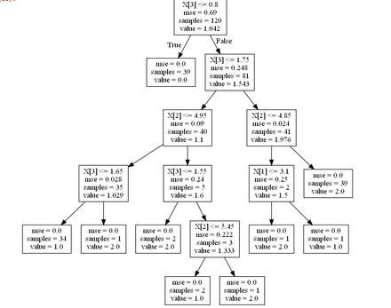

As you can see, that since we did not provide a maximum depth of the tree, it created a complex tree of 6 layers and hence for our model we are getting 100% accuracy. This means that the model is an **overfitted model**.

Let's fix this by creating a simpler model.


```python
#Creating a model that is only 2 layers deep by setting max_depth=3
regressor = DecisionTreeRegressor(random_state=0,criterion='mse', splitter='best', max_depth=3, min_samples_split=3, min_samples_leaf=2 )
regressor.fit(x_train, y_train)

y_predict=regressor.predict(x_test)

print(regressor.score(x_test,y_test))
```

    0.9739827477382705


> As you can see that the model is not an overfit anymore and still gives us pretty good accuracy of __97.4%__.  
Looking at the decision tree now.

```python
from sklearn.externals.six import StringIO
from IPython.display import Image
from sklearn.tree import export_graphviz
import pydotplus
from sklearn import tree

dot_data = StringIO()  
tree.export_graphviz(regressor, out_file=dot_data)
graph = pydotplus.graph_from_dot_data(dot_data.getvalue())  
Image(graph.create_png())

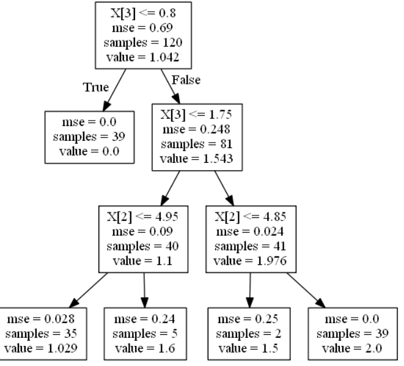
```

So keep climbing the tree of success with this DecisionTree regression model. In the next series, we will see how to use a kind of decision tree called Random forest regression.
